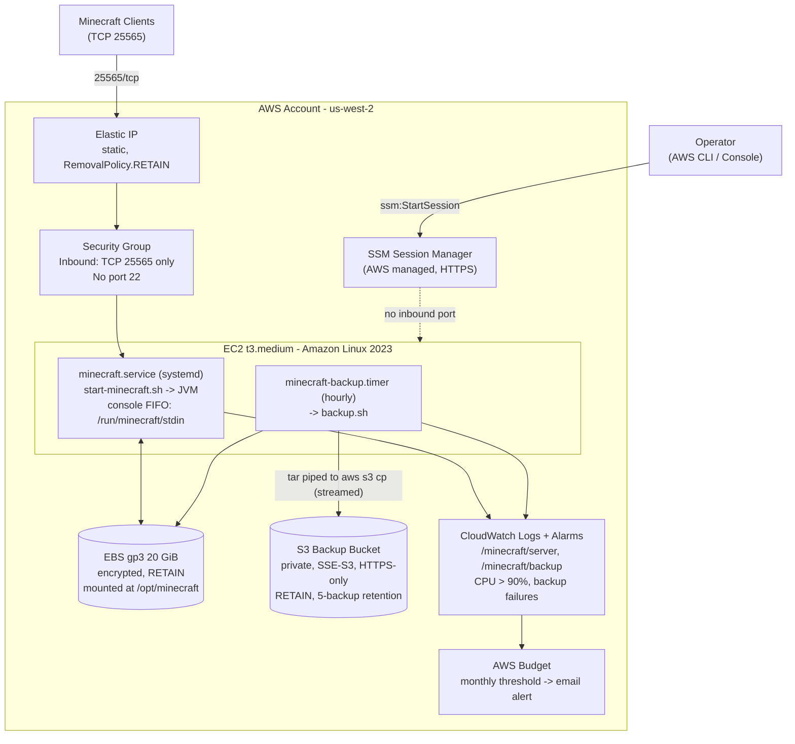

# Minecraft AWS

A private Minecraft Java Edition server hosted on AWS, provisioned entirely with
AWS CDK (TypeScript). It gives a small group of friends a **secured, whitelist-only
server on a stable public IP**, while keeping the operational footprint and cost
close to zero when nobody's playing.

## Purpose

This repo exists to run a **private** Minecraft server that is nonetheless
**publicly reachable on a static IP address**, without opening up the usual attack
surface that "public server" implies:

- **Publicly exposed, static IP** - an Elastic IP is bound to the instance so the
  address never changes across stops/starts/replacements. Players connect to
  `<ip>:25565` and never need to look up a new address.
- **Secured by default, not by afterthought**:
  - Only the Minecraft port (`25565/tcp`) is open to the internet. There is no
    inbound SSH rule and no SSH key anywhere in this repo.
  - All administration (start/stop, console access, log inspection, whitelist
    management) goes through **AWS Systems Manager Session Manager** over HTTPS -
    no bastion host, no open management port.
  - The Minecraft whitelist is enforced server-side (`white-list=true`,
    `enforce-whitelist=true`) with `online-mode=true`, so only approved,
    Mojang-authenticated accounts can ever join.
  - Data is encrypted at rest (EBS, S3 SSE-S3) and in transit (S3 HTTPS-only
    bucket policy).
  - The EC2 instance role is least-privilege: scoped S3 access, scoped
    CloudWatch Logs access, no EC2 control-plane permissions.
- **Cheap to run intermittently** - the EC2 instance is started/stopped manually
  (no 24/7 requirement); world data lives on a retained EBS volume so nothing is
  lost between sessions, and an AWS Budget alert guards against runaway spend.
- **Durable by design** - hourly backups stream straight to S3 (no disk staging),
  with 5-backup retention and a scripted, self-verifying restore path. The EBS
  volume, S3 bucket, and Elastic IP all use `RemovalPolicy.RETAIN`, so accidental
  `cdk destroy` or instance replacement can't silently delete the world.

See [docs/requirements.md](docs/requirements.md) for the authoritative spec this
project is built against, and [docs/security.md](docs/security.md) for the full
security model.

## Architecture



See [docs/architecture.md](docs/architecture.md) for the component-by-component
breakdown, design rationale, and a monthly cost estimate.

## Repository Layout

```
infra/                  All CDK code (TypeScript)
  bin/minecraft.ts       CDK app entrypoint
  lib/minecraft-stack.ts The stack - VPC/SG, EBS+S3, IAM, EC2, CloudWatch, EIP+DNS
  config/server-config.ts Centralized, typed configuration (instance type, Minecraft
                           version, volume size, Java heap, backup retention, budget...)
  assets/                 Instance-side bash/systemd, shipped as a versioned S3 asset:
                           install.sh, start-minecraft.sh, backup.sh, restore.sh,
                           find-ebs-device.sh, systemd units, CloudWatch agent config
  scripts/                 Operator scripts: deploy-check-and-push.sh (guarded deploy
                           wrapper), ec2-start.sh / ec2-stop.sh / ec2-status.sh
  test/                    Jest (CDK assertions) + Bats (backup/restore shell) tests
docs/                    Design docs - read before changing infra
  requirements.md         Authoritative functional/infra/safety spec
  architecture.md         Component design + diagram + cost estimate
  security.md             Security model (network, IAM, encryption, EULA)
  operations.md           Day-to-day operator runbook (start/stop/console/whitelist/logs)
  backup-and-restore.md   Backup internals + restore procedures
  migration-plan.md       Notes on migrating/replacing the instance
```

## Prerequisites

- An AWS account you control, with credentials for a profile that can deploy CDK
  stacks (CloudFormation, EC2, S3, IAM, CloudWatch, Budgets, SSM).
- [AWS CLI v2](https://docs.aws.amazon.com/cli/latest/userguide/getting-started-install.html)
  and the [Session Manager plugin](https://docs.aws.amazon.com/systems-manager/latest/userguide/session-manager-working-with-install-plugin.html)
  installed locally.
- Node.js `22` (see [.nvmrc](.nvmrc); `nvm use` if you use nvm) and npm.
- A Minecraft Java Edition account/username for each player you intend to whitelist.
- You must personally read and accept the
  [Minecraft EULA](https://aka.ms/MinecraftEULA) before deploying - this project
  will not run the server otherwise (see "Configure" below).

## Setup

### 1. Install dependencies

```bash
cd infra
npm install
```

### 2. Configure the deployment

Review [infra/config/server-config.ts](infra/config/server-config.ts) and override
whatever you need for your deployment (region, instance type, Minecraft version,
volume size, Java heap, backup retention, monthly budget, optional DNS hostname).
Defaults target `us-west-2` with a `t3.medium` instance suitable for 2-10 players.

**Do not** set `minecraftEulaAccepted: true` in this file - see the EULA note
below.

### 3. Set the budget alert email (SSM Parameter Store)

The budget alert address is intentionally kept out of git. Put it in Parameter
Store before your first deploy:

```bash
aws ssm put-parameter --name /minecraft/budget-alert-email \
  --type String --value "you@example.com" \
  --profile <your-profile> --region us-west-2
```

### 4. Accept the Minecraft EULA (deploy-time only, never committed)

Read the [EULA](https://aka.ms/MinecraftEULA). If you accept it, opt in at
**deploy time** via an environment variable - the repository default
(`minecraftEulaAccepted: false` in `server-config.ts`) must stay `false` in git:

```bash
export CDK_MINECRAFT_EULA_ACCEPTED=true
```

### 5. Validate locally (no AWS calls)

```bash
npm run build          # tsc type-check
npm test                # Jest - CDK assertion tests
npm run test:shell      # Bats - backup/restore script tests
npm run predeploy       # runs all three of the above
npx cdk synth           # emit CloudFormation template to cdk.out/
```

## Deploy

Deploying is an AWS-mutating operation - review the diff before applying it.

```bash
cd infra
npx cdk diff MinecraftStack --profile <your-profile> --region us-west-2
npx cdk deploy MinecraftStack --profile <your-profile> --region us-west-2
```

Or use the guarded wrapper, which runs `predeploy`, shows a change set for review,
and only executes on confirmation (or `--yes`):

```bash
npm run deploy:all -- --profile <your-profile> --region us-west-2
```

Run `npm run deploy:all -- --help` (or read
[infra/README.md](infra/README.md)) for the full flag list, including
`--account-id`, `--outputs-file`, `--skip-checks`, `--skip-diff`.

On success, stack outputs (instance ID, Elastic IP, bucket names, etc.) are
written to `infra/minecraft-outputs.json`.

## Operate the server

The `infra/scripts/` helpers resolve the instance ID from
`minecraft-outputs.json` or the `MinecraftStack` CloudFormation outputs
automatically (override with `--instance-id`, `--profile`, `--region`, etc.):

```bash
cd infra
bash scripts/ec2-status.sh     # current instance state
bash scripts/ec2-start.sh      # start - Minecraft starts automatically via systemd
bash scripts/ec2-stop.sh       # stop - world is flushed and saved before shutdown
```

Connect for administration (whitelist, console commands, logs) via SSM - no SSH:

```bash
aws ssm start-session --target <InstanceId> --profile <your-profile> --region us-west-2
```

Full operator runbook - starting/stopping, checking bootstrap health, managing the
whitelist, viewing logs, running manual backups, re-running the installer after an
asset update - is in **[docs/operations.md](docs/operations.md)**.

Backup internals and step-by-step restore procedures (including the automated,
self-rolling-back `restore.sh`) are in
**[docs/backup-and-restore.md](docs/backup-and-restore.md)**.

## Tests

All commands run from `infra/`:

```bash
npm run build          # tsc type-check (noEmit)
npm test                # Jest - CDK assertion tests (infra/test/*.test.ts)
npm run test:shell      # Bats - backup/restore script tests
npm run predeploy       # everything above, in sequence
npx jest -t "<name>"    # run a single Jest test by name
```

## Further reading

| Doc | Covers |
|---|---|
| [docs/requirements.md](docs/requirements.md) | Authoritative functional, infrastructure, and safety spec |
| [docs/architecture.md](docs/architecture.md) | Component design, diagram, design-decision rationale, cost estimate |
| [docs/security.md](docs/security.md) | Network security, IAM scoping, encryption, EULA, secrets handling |
| [docs/operations.md](docs/operations.md) | Day-to-day operator runbook |
| [docs/backup-and-restore.md](docs/backup-and-restore.md) | Backup internals and restore procedures |
| [docs/migration-plan.md](docs/migration-plan.md) | Notes on migrating/replacing the instance |
| [infra/README.md](infra/README.md) | CDK-specific commands, the guarded deploy wrapper, and operations quick-reference |
